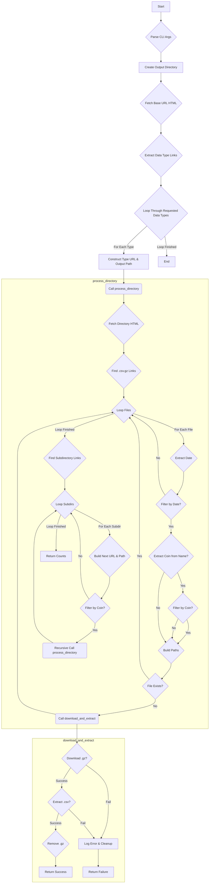

# Bybit Historical Data Downloader

[](https://opensource.org/licenses/MIT)

This script downloads historical market data (trades, klines, etc.) for specified cryptocurrency pairs from the Bybit public data repository ([https://public.bybit.com/](https://public.bybit.com/)). It allows filtering by date range, coin pairs, and data types, organizing the downloaded and extracted CSV files into a structured directory format.

## Features

*   **Command-line Interface:** Configure downloads using CLI arguments.
*   **Flexible Filtering:**
    *   Specify start and end dates (`--start-date`, `--end-date`).
    *   Select specific coin pairs (e.g., `BTCUSDT,ETHUSDT`) or download all (`--coins ALL`).
    *   Choose data types (e.g., `trading,spot`) or download all (`--data-types ALL`).
*   **Organized Output:** Data is saved to a specified output directory (`--output-dir`, default `./data`), with subdirectories for each data type (e.g., `./data/trading/`, `./data/spot/`).
*   **Recursive Directory Traversal:** Handles different directory structures found in the Bybit repository (e.g., flat file lists, coin-based subdirectories, year-based subdirectories).
*   **Automatic Extraction:** Downloads `.csv.gz` archives, extracts them to `.csv`, and removes the archives.
*   **Skip Existing:** Avoids re-downloading and extracting files if the `.csv` file already exists.
*   **Basic Logging:** Provides informative output about the download process.

## Requirements

*   Python 3.8+
*   Libraries: `requests`, `beautifulsoup4`

## Installation (using Poetry)

1.  **Install Poetry:** Follow the instructions at [https://python-poetry.org/docs/#installation](https://python-poetry.org/docs/#installation)
2.  **Clone the repository:**
    ```bash
    git clone https://github.com/suenot/bybit-history
    cd bybit-history
    ```
3.  **Install dependencies:**
    ```bash
    poetry install
    ```

## Usage

```bash
poetry run python bybit_data_downloader.py --start-date <YYYY-MM-DD> --coins <COINS> [OPTIONS]
```

**Required Arguments:**

*   `--start-date <YYYY-MM-DD>`: The earliest date for data to download.
*   `--coins <COINS>`: Comma-separated list of coin pairs (e.g., `BTCUSDT,ETHUSDT`) or `ALL` to attempt downloading all found pairs.

**Optional Arguments:**

*   `--end-date <YYYY-MM-DD>`: The latest date for data to download. If omitted, downloads up to the most recent available data.
*   `--data-types <TYPES>`: Comma-separated list of data types (e.g., `trading,spot`) or `ALL`. Defaults to `trading`. Known types: `trading`, `spot`, `kline_for_metatrader4`, `premium_index`, `spot_index`.
*   `--output-dir <PATH>`: Directory to save the data. Defaults to `./data`.
*   `--base-url <URL>`: Base URL for the Bybit public data. Defaults to `https://public.bybit.com/`.
*   `--version`: Show script version and exit.
*   `--help`: Show help message and exit.

**Example:**

```bash
poetry run python bybit_data_downloader.py --start-date 2023-01-01 --end-date 2023-01-31 --coins BTCUSDT,ETHUSDT --data-types trading,spot --output-dir ./bybit_data
```

## Algorithm Overview



## License

This project is licensed under the MIT License - see the [LICENSE](LICENSE) file for details (if available). 